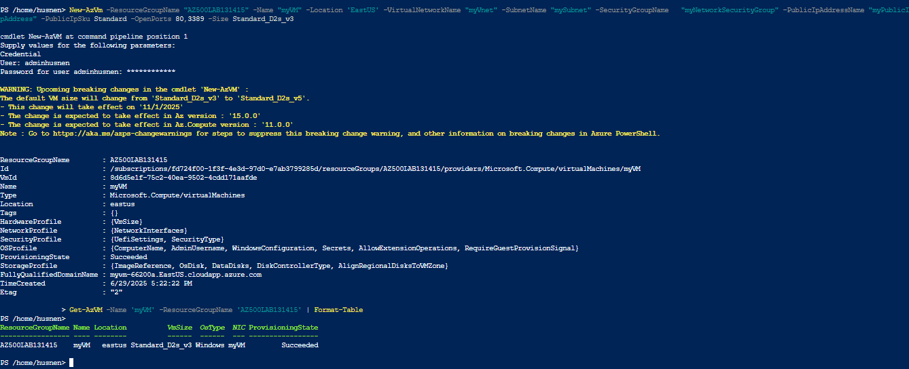
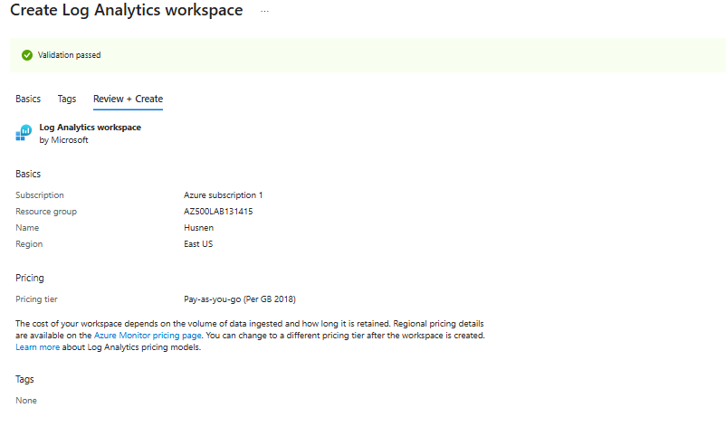
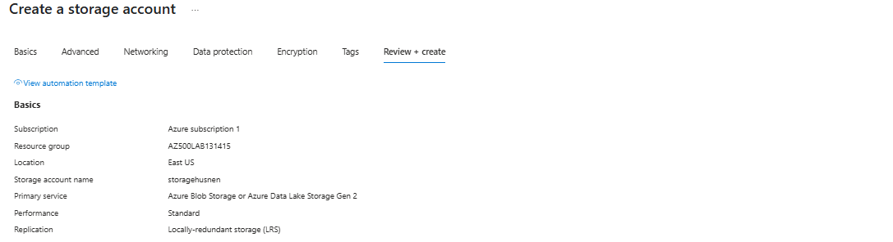
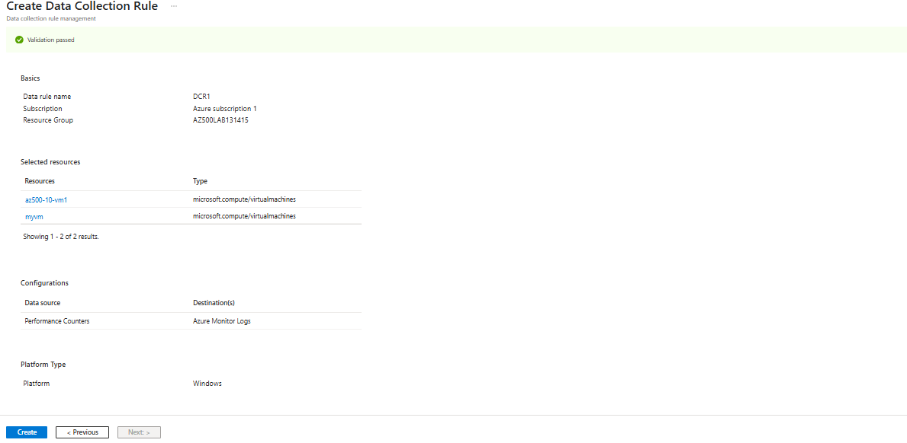
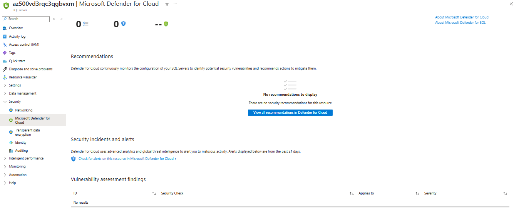
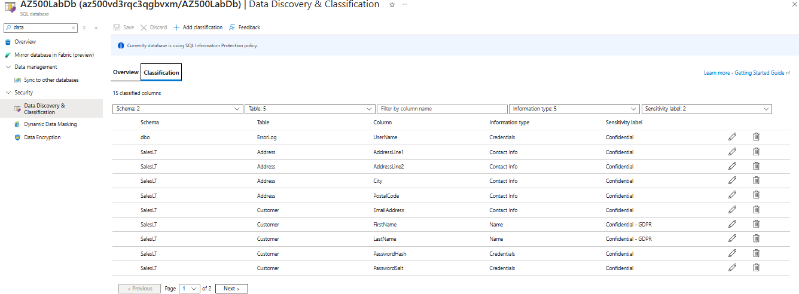
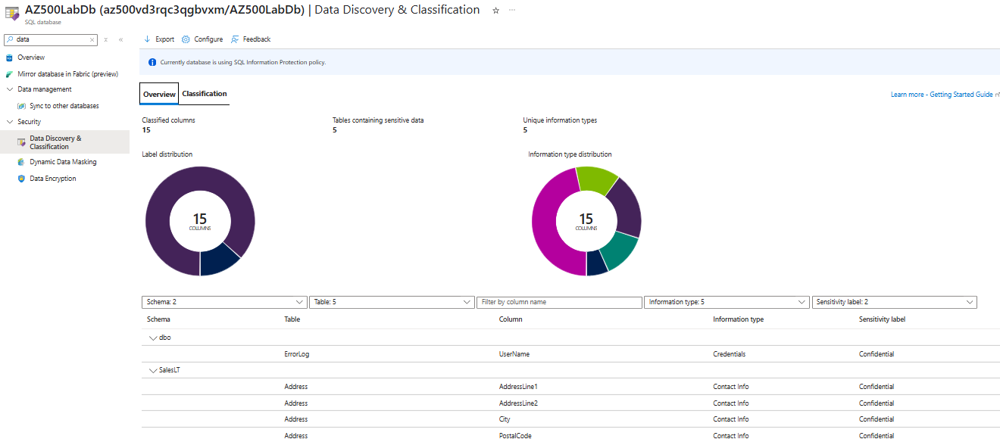
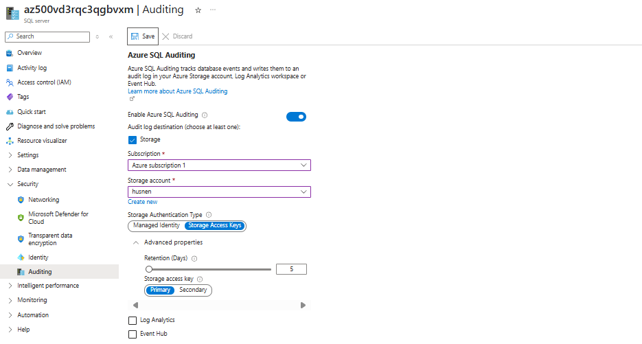

# 📊 Azure Monitoring & Analytics Project

This project focuses on centralized monitoring and data protection in Azure, using **Azure Monitor**, **Log Analytics**, **Data Collection Rules (DCR)**, and **Defender for SQL**. All resources were deployed in the **East US region**.

---

## 🧪 Lab 1: Azure Monitor Agent and Data Collection

### 🎯 Objective:
Deploy a virtual machine and enable telemetry collection using Azure Monitor and Log Analytics.

### ✅ What Was Done:

- Deployed a VM using **PowerShell via Azure Cloud Shell**
- Created a **Log Analytics Workspace** (`LogAnalyticsWorkspace`)
- Created a **Storage Account** for storing logs
- Created a **Data Collection Rule** (`DCR1`)
  - Attached DCR to the VM
  - Added performance counters:  
    - CPU  
    - Memory  
    - Disk  
    - Network  
- Verified data flow to Log Analytics

### 🖼️ Proof Screenshots:

---

## 🧪 Lab 2: Securing Azure SQL Database

### 🎯 Objective:
Harden SQL database security by enabling threat protection, data classification, and auditing.

### ✅ What Was Done:

- Deployed **SQL Server & Database** using a custom template
- Enabled **Microsoft Defender for SQL** under server settings
- Ran **Data Classification** scan and applied 15 sensitivity labels
- Configured **Auditing**:
  - Set up a dedicated **Storage Account** for logs
  - Enabled **Server-level and Database-level auditing**
- Signed into the SQL query editor to generate sample events

### 🖼️ Proof Screenshots:

---

## ✅ Summary

This lab demonstrates end-to-end visibility and security monitoring using Azure-native solutions, covering:

- Infrastructure telemetry via Log Analytics
- DCR setup and performance counter collection
- SQL security with classification, Defender, and auditing
