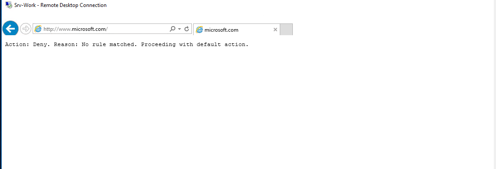

# 🔐 Azure Security and Access Control Project

This project covers four practical labs in Microsoft Azure, focused on improving network security and access controls. Tasks include securing virtual machines with NSGs, managing role-based access, configuring Azure Firewall, and implementing secure storage with service endpoints.

All resources were deployed in the **East US** region.

---

## 🧪 Lab 1: Network Security Groups (NSG) and Application Security Groups (ASG)

**🎯 Objective:**  
Secure access between virtual machines using NSGs and ASGs.

**✅ What Was Done:**
- Created a virtual network with a subnet.
- Created two ASGs: `WebServers` and `ManagementServers`.
- Configured a NSG with rules to:
  - Allow HTTP/HTTPS to Web ASG
  - Allow RDP to Management ASG
- Deployed two VMs:
  - Web server
  - Management server
- Assigned ASGs to VM NICs.
- Tested RDP and HTTP access to confirm security rule enforcement.

**📸 Proof Screenshots:**

---

## 🧪 Lab 2: Role-Based Access Control (RBAC)

**🎯 Objective:**  
Control resource access using Azure RBAC.

**✅ What Was Done:**
- Created three users using:
  - Azure Portal
  - PowerShell
  - Azure CLI
- Created three Azure AD groups:
  - `Senior Admins`
  - `Junior Admins`
  - `Service Desk`
- Added users to their respective groups.
- Assigned **Virtual Machine Contributor** role to `Service Desk` group.

**📸 Proof Screenshots:**

---

## 🧪 Lab 3: Azure Firewall Configuration

**🎯 Objective:**  
Restrict outbound internet access using Azure Firewall.

**✅ What Was Done:**
- Deployed a virtual network with two subnets.
- Launched one VM in each subnet.
- Deployed Azure Firewall in a dedicated subnet.
- Created a custom route to force traffic from workload subnet through the firewall.
- Configured rules:
  - **Application Rule**: Allow traffic to `www.bing.com`
  - **Network Rule**: Allow DNS traffic (port 53) to specific IPs
- Manually set DNS servers on VM NIC.
- Tested and validated outbound internet control.

**📸 Proof Screenshots:**

---

## 🧪 Lab 4: Service Endpoints and Storage Security

**🎯 Objective:**  
Restrict storage access to a private subnet using service endpoints and NSGs.

**✅ What Was Done:**
- Created virtual network with:
  - One public subnet
  - One private subnet
- NSG Rules:
  - **Private subnet**: Allow Storage, Deny Internet
  - **Public subnet**: Allow RDP only
- Created a Storage Account with a file share.
- Enabled **Service Endpoint** for Storage in the private subnet.
- Deployed one VM in each subnet.

**🔍 From Private VM:**
- Successfully mounted storage share (`Z:` drive)
- Internet access failed (as expected)

**🔍 From Public VM:**
- Storage mount attempt failed (blocked)
- Internet access worked

**📸 Proof Screenshots:**

---

## ✅ Summary of Skills Demonstrated

- Network segmentation using NSG & ASG
- Identity-based access control via RBAC
- Outbound access control with Azure Firewall
- Storage hardening with private endpoints and NSG logic
- Real-world validation of access paths and security rules

---

## 🧰 Tools Used

| Area               | Technologies                      |
|--------------------|-----------------------------------|
| Access Control     | Azure RBAC, Azure AD              |
| Network Security   | NSG, ASG, Azure Firewall          |
| Storage Security   | Service Endpoints, NSGs           |
| VM Deployment      | Azure Portal, PowerShell, Azure CLI |
| Verification       | RDP, HTTP, Storage Mount, DNS     |

---

## 📍 Region

All labs were conducted in: **East US (Azure Region)**

