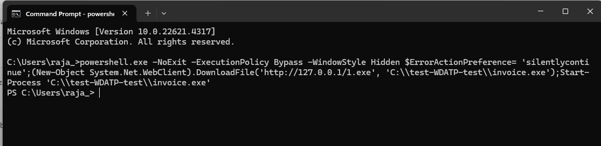

# 🛡️ Microsoft 365 Defender, Security Copilot & Threat Response Simulation

This project simulates end-to-end security operations using Microsoft 365 Defender, Security Copilot, Microsoft Purview, and Defender for Endpoint. It covers threat policy configuration, incident response, role-based access, audit tracking, and compliance standards.

---

## 🔧 Lab Tasks

### ✅ 1. Defender for Office 365 & XDR Setup
- Enabled **Standard** and **Strict** preset protection policies:
  - Anti-phishing, anti-malware, anti-spam
  - Safe Links and Safe Attachments
- Defender XDR workspace was initialized successfully
- Device discovery was enabled to detect unmanaged endpoints

---

### ✅ 2. Security Copilot Provisioning
- Assigned **Owner** role in Azure IAM  
- Set up **Copilot capacity** in the Security compute portal  
- Verified provisioning completion in Copilot portal  
- Confirmed owner permissions in role assignment panel

- 

- 

---

### ✅ 3. Endpoint Configuration & RBAC
- **Onboarded** a test device using PowerShell  
- Created custom role **Tier 1 Support** with security read permissions  
- Defined **Device Group**: Regular (Full Remediation access)

- 

- 

---

### ✅ 4. Audit Logs & Compliance Standards
- Enabled **Audit (Standard)** logging in Microsoft Purview  
- Activated compliance standard: **ISO/IEC 27001:2013**

- 

- 

---

### ✅ 5. Threat Simulation & Incident Analysis
- Executed test **PowerShell alert** using simulated command  
- Verified **security alerts** in Defender portal  
- Analyzed incident propagation using **Incident Graph**

- 

- 

- 

---

## 🧠 Skills Demonstrated

- Defender for Office 365 policy configuration  
- Security Copilot provisioning and IAM role setup  
- Device onboarding and grouping  
- Role-based access configuration  
- Audit logging and compliance standards (ISO 27001)  
- Alert triage and incident graph analysis

---

