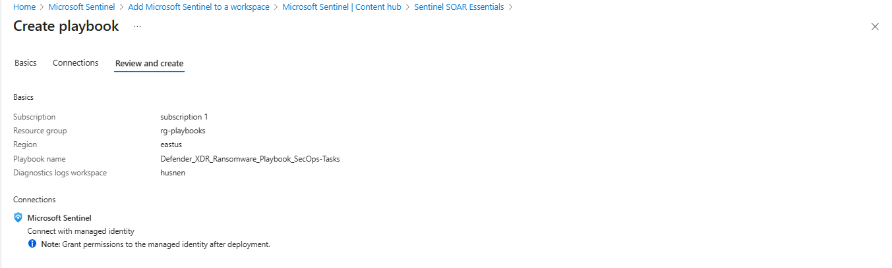
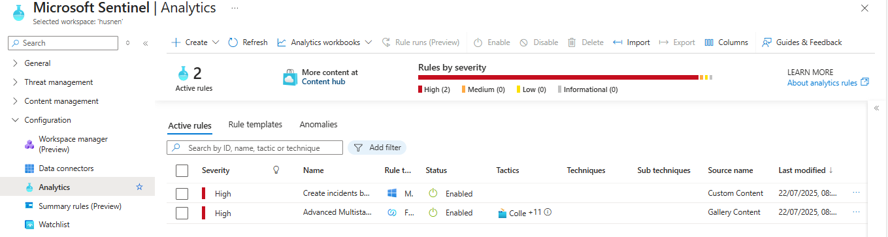
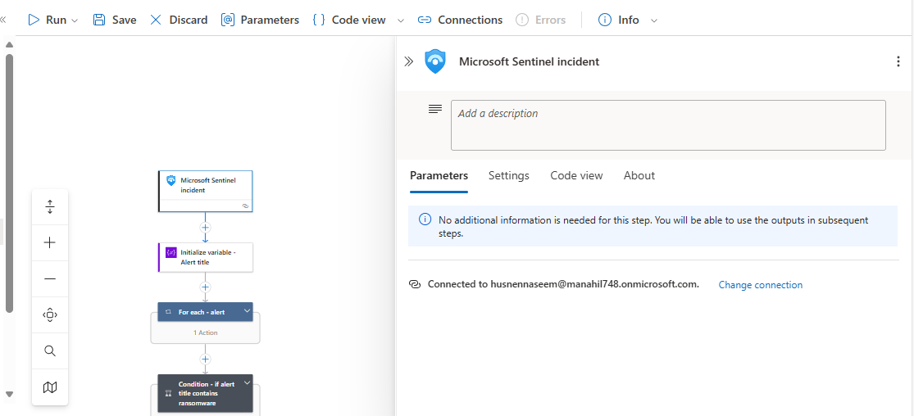
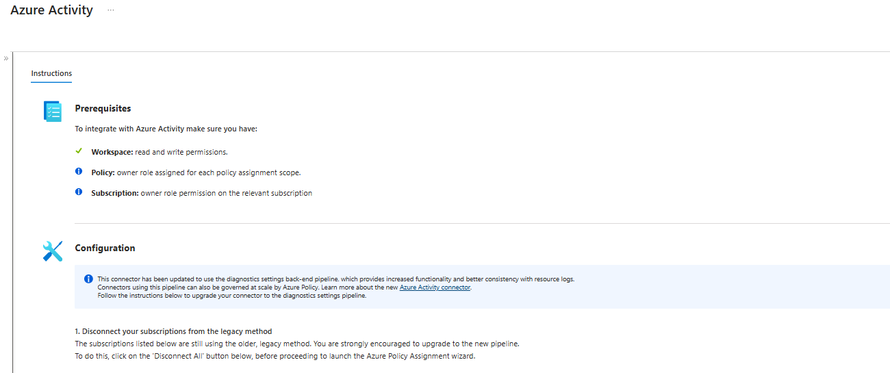
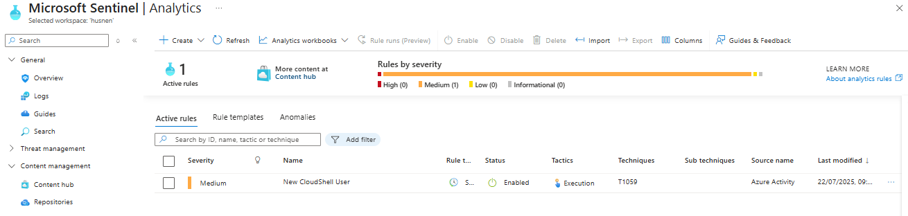
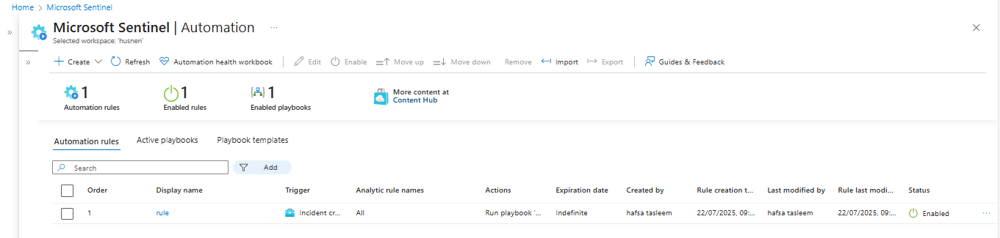
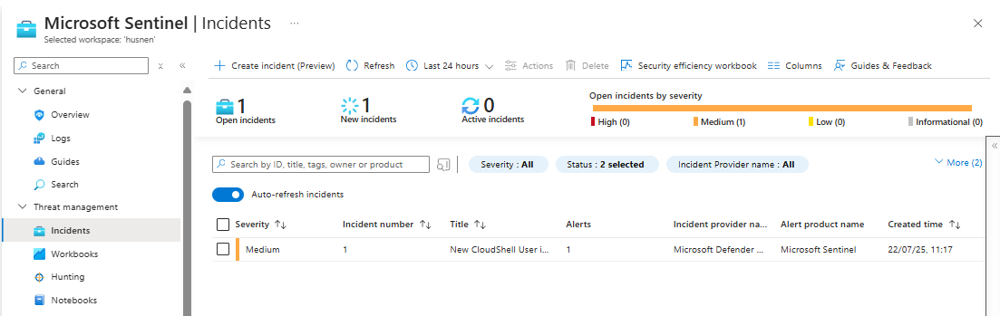
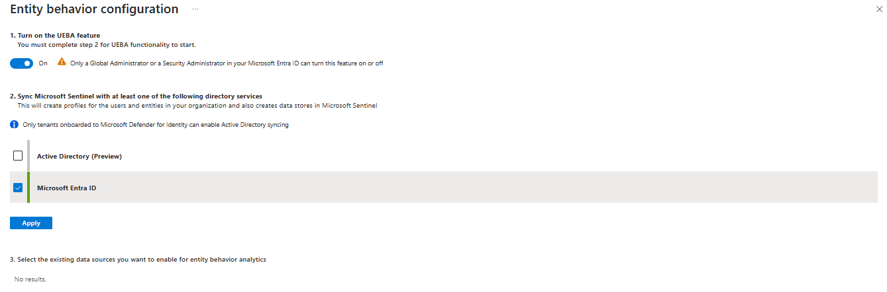
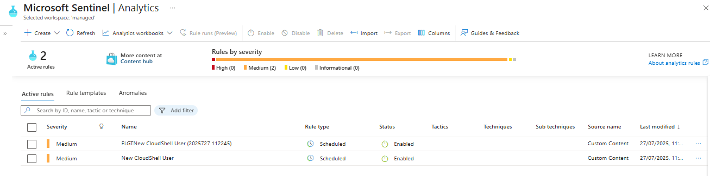

# 🛡️ Microsoft Sentinel: SIEM & SOAR Automation Project

This project demonstrates the end-to-end configuration of **Microsoft Sentinel** for advanced threat detection, automated incident response (SOAR), and behavioral analytics. It includes analytics rule creation, playbook deployment, automation setup, and UEBA tuning — integrated with **Microsoft Defender**.

---

## 🧩 Project Tasks

### ✔️ Task 1: Create Analytics Rule
- Created rule: `Create incidents based on Defender for Cloud`
- Filtered by severity: **Low**, **Medium**, **High**
- Connected to: **Microsoft Defender for Cloud**
- Verified successful rule deployment and activation

📸 Screenshot:  

---

### ✔️ Task 2: Deploy Sentinel SOAR Playbook
- Installed **Sentinel SOAR Essentials** from Content Hub
- Deployed: `Defender_XDR_Ransomware_Playbook_for_SecOps-Tasks`
- Created under resource group: `rg-playbooks` (East US)
- Enabled Microsoft Sentinel managed identity

📸 Screenshots:  

 

---

### ✔️ Task 3: Configure Automation Rule
- Trigger: **When incident is created**
- Filter: Incidents with tactics like Reconnaissance, Execution, C2, etc.
- Action: **Run Playbook**
  - Used: `Defender_XDR_Ransomware_Playbook_SecOps_Tasks`
  - Granted Sentinel permissions to execute playbook

📸 Screenshot:  

---

### ✔️ Task 4: Connect Azure Activity Logs
- Installed **Azure Activity** solution from Content Hub
- Used **Azure Policy Assignment Wizard** to connect subscription
- Confirmed successful ingestion into Log Analytics workspace

📸 Screenshot:  

---

### ✔️ Task 5: Create Scheduled Query Rule
- Created rule: `New CloudShell User`
- Severity: **Medium**
- Schedule: Every 5 minutes, query past 1 day
- Trigger: Detection of suspicious CloudShell activity

📸 Screenshot:  

---

### ✔️ Task 6: Automate CloudShell Rule Response
- Edited `New CloudShell User` rule
- Added automation rule: `Tier 2`
  - Action: Assign incident to self

📸 Screenshot:  

---

### ✔️ Task 7: Validate Alert Generation
- Accessed **Azure Cloud Shell** to trigger activity
- Verified incident generation in Microsoft Sentinel
- Incident Title: `New CloudShell User initiated`

📸 Screenshot:  

---

### ✔️ Task 8: Enable UEBA & Anomaly Detection
- Activated **Entity Behavior Analytics (UEBA)**
- Duplicated an anomaly rule and changed to **Flighting Mode**
- Lowered threshold score to increase detection sensitivity

📸 Screenshots:  

  

---
